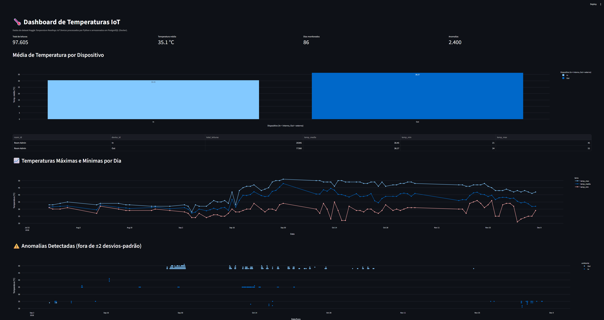
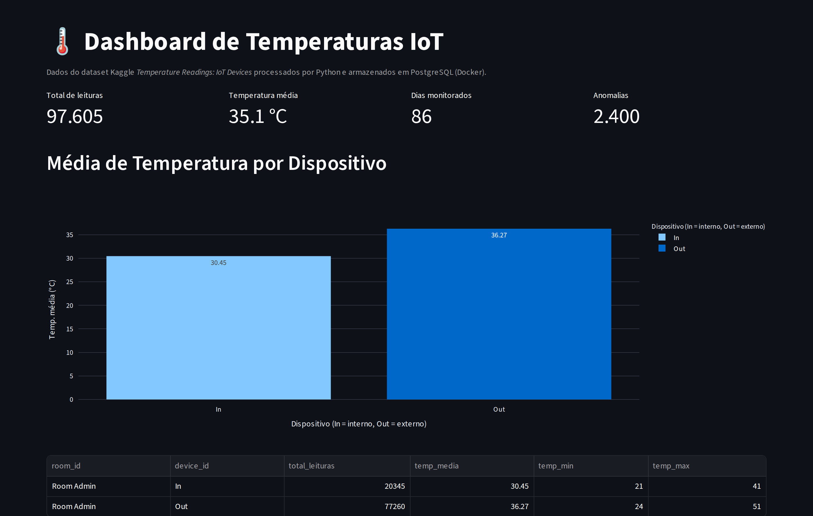
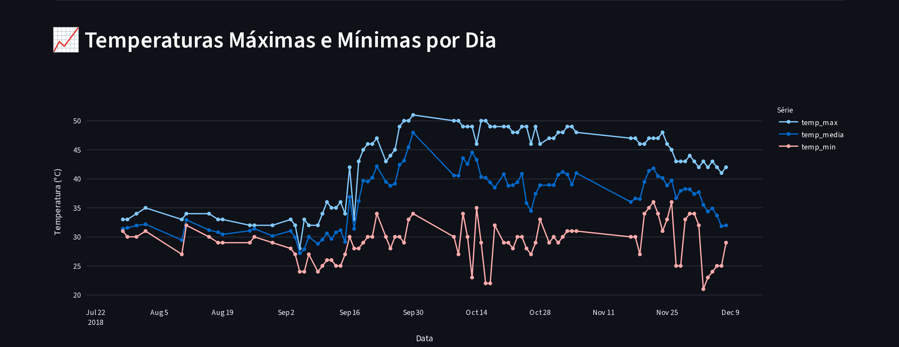
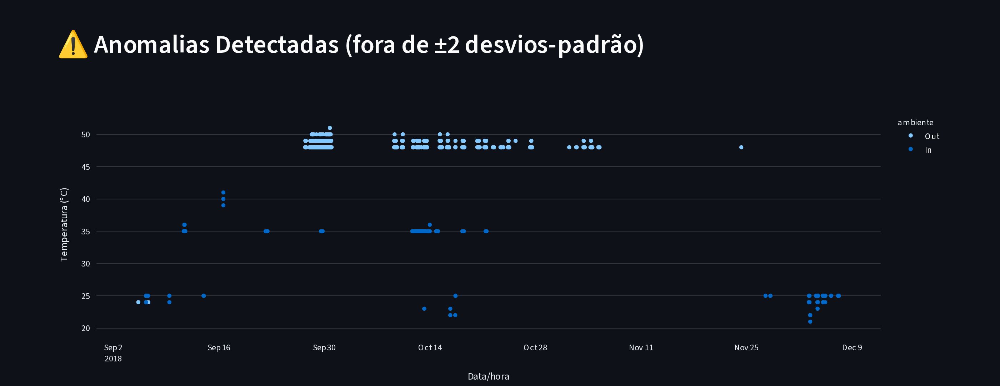
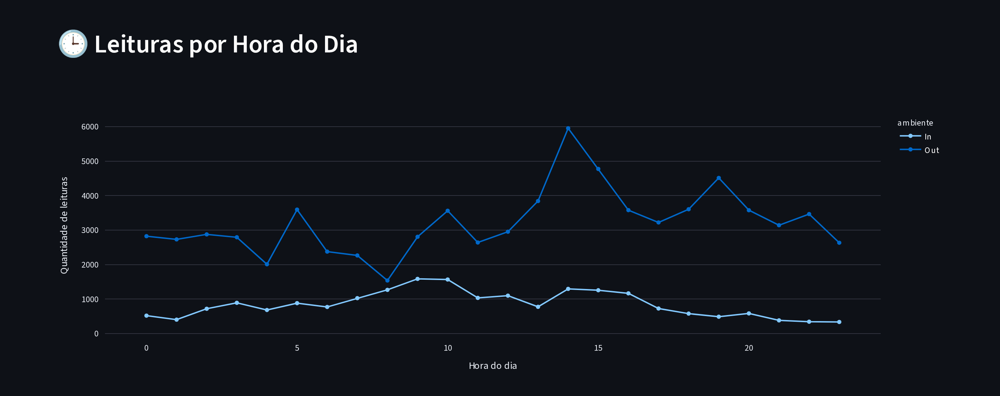

# 🌡️ Pipeline de Dados com IoT e Docker

Projeto da disciplina **Disruptive Architectures: IoT, Big Data e IA** (UniFECAF).

Pipeline completo que lê leituras de temperatura de sensores IoT, trata os dados com **Python**, armazena em um **PostgreSQL rodando no Docker**, cria **views SQL** de análise e exibe tudo em um **dashboard interativo com Streamlit + Plotly**.

```
CSV (Kaggle) ──► etl.py (pandas) ──► PostgreSQL (Docker) ──► views SQL ──► app.py (Streamlit)
```

## 🧰 Tecnologias

| Tecnologia | Uso no projeto |
|---|---|
| Python 3.10+ | Linguagem do ETL e do dashboard |
| pandas | Leitura e tratamento do CSV |
| SQLAlchemy + psycopg2 | Conexão com o PostgreSQL |
| Docker / Docker Compose | Contêiner do banco PostgreSQL |
| PostgreSQL 16 | Armazenamento dos dados e views de análise |
| Streamlit | Dashboard web |
| Plotly | Gráficos interativos |
| python-dotenv | Leitura das credenciais do arquivo `.env` |

## 📁 Estrutura

```
iot-pipeline/
├── data/
│   └── temperature_readings.csv   # dataset do Kaggle
├── docs/
│   ├── relatorio/                 # relatório teórico em PDF
│   └── screenshots/               # prints do dashboard
├── sql/
│   ├── schema.sql                 # criação da tabela
│   └── view.sql                   # views de análise
├── src/
│   ├── config.py                  # conexão com o banco (lê o .env)
│   ├── etl.py                     # extrai, trata e carrega o CSV
│   ├── create_view.py             # cria as views no PostgreSQL
│   └── app.py                     # dashboard Streamlit
├── .env.example                   # modelo das variáveis de ambiente
├── docker-compose.yml             # contêiner PostgreSQL
└── requirements.txt               # dependências Python
```

## 📊 Base de dados

**Temperature Readings: IoT Devices** (Kaggle):
<https://www.kaggle.com/datasets/atulanandjha/temperature-readings-iot-devices>

O arquivo já está em `data/temperature_readings.csv`. Ele tem ~97,6 mil leituras (jul/2018 a dez/2018) com as colunas:

| Coluna no CSV | Coluna no banco | Descrição |
|---|---|---|
| `id` | `reading_id` | Identificador da leitura |
| `room_id/id` | `room_id` | Sala do sensor |
| `noted_date` | `noted_date` | Data/hora (convertida de `dd-mm-aaaa hh:mm` para `TIMESTAMP`) |
| `temp` | `temperature` | Temperatura em °C |
| `out/in` | `location` | `In` = sensor interno, `Out` = sensor externo |

## 🚀 Como executar

### Pré-requisitos
- [Python 3.10+](https://www.python.org/downloads/)
- [Docker Desktop](https://www.docker.com/products/docker-desktop/)
- [Git](https://git-scm.com/)

### 1. Clonar o repositório
```bash
git clone https://github.com/KaiqueDev1/iot-faculdade-setembro.git
cd iot-faculdade-setembro
```

### 2. Configurar as variáveis de ambiente
```bash
# Windows
copy .env.example .env
# Linux/macOS
cp .env.example .env
```

### 3. Subir o PostgreSQL no Docker
```bash
docker compose up -d
docker ps          # o contêiner "postgres-iot" deve aparecer como "healthy"
```

> Alternativa sem Compose (comando do enunciado):
> `docker run --name postgres-iot -e POSTGRES_PASSWORD=admin -e POSTGRES_DB=iot_db -p 5432:5432 -d postgres`

### 4. Criar o ambiente virtual e instalar as dependências
```bash
python -m venv venv
# Windows
venv\Scripts\activate
# Linux/macOS
source venv/bin/activate

pip install -r requirements.txt
```

### 5. Carregar os dados (ETL)
```bash
python src/etl.py
```
Saída esperada:
```
[extract] 97606 linhas lidas de temperature_readings.csv
[transform] 1 linha(s) removida(s) (nulos/duplicados)
[load] 97605 linhas gravadas no PostgreSQL
```

### 6. Criar as views SQL
```bash
python src/create_view.py
```

### 7. Verificar os dados no PostgreSQL (opcional)
```bash
docker exec -it postgres-iot psql -U postgres -d iot_db -c "SELECT COUNT(*) FROM temperature_readings;"
docker exec -it postgres-iot psql -U postgres -d iot_db -c "SELECT * FROM vw_resumo_dispositivo;"
```

### 8. Abrir o dashboard
```bash
streamlit run src/app.py
```
Acesse <http://localhost:8501>.

## 🗂️ Views SQL

Todas as views estão em [`sql/view.sql`](sql/view.sql).

| View | Propósito |
|---|---|
| `vw_resumo_dispositivo` | Resumo de cada sensor (In/Out): total de leituras, temperatura média, mínima e máxima. Mostra a diferença entre o ambiente interno e o externo. |
| `vw_anomalias` | Leituras que ficam a mais de 2 desvios-padrão da média do **próprio** ambiente (z-score). Assim, 40 °C no sensor externo pode ser normal, mas no interno é anomalia. Serve de base para alertas. |
| `vw_tendencia` | Máxima, mínima e média de cada dia em ordem cronológica. Mostra a evolução da temperatura ao longo dos meses. |
| `vw_leituras_por_hora` *(extra)* | Quantidade de leituras e temperatura média por hora do dia e por ambiente. Mostra em que horários os sensores mais registram dados. |

## 🖼️ Dashboard



| | |
|---|---|
|  |  |
|  |  |

## 💡 Insights

- **Externo é mais quente e muito mais instável:** média de ~36,3 °C no sensor externo contra ~30,5 °C no interno. O desvio-padrão externo (~5,7 °C) é mais que o dobro do interno (~2,2 °C). O ambiente interno funciona como "amortecedor" térmico.
- **Aquecimento a partir de outubro:** a média externa sobe de ~31 °C (jul–set) para ~40 °C (out–nov), enquanto a interna quase não muda. Isso indica sazonalidade e boa isolação do ambiente interno.
- **~79% das leituras vêm do sensor externo**, ou seja, a frequência de coleta não é igual entre os dispositivos.
- **Anomalias:** cerca de 2,5% das leituras (~2.400) estão fora de ±2 desvios-padrão. As internas chegam a 41 °C, um pico incomum para um ambiente fechado.
- **Falhas de coleta:** existem 86 dias com leituras dentro de um período de ~4 meses e meio, o que mostra dias sem nenhum dado (sensor desligado ou falha de transmissão).
- **Picos de leitura à tarde** (14h–15h), horário de maior atividade/registro dos sensores.

### Uso prático em um ambiente real
- Alertas automáticos (e-mail, Telegram) quando surgir uma leitura em `vw_anomalias`.
- Controle de climatização: ligar o ar-condicionado quando a temperatura externa passar de um limite.
- Monitoramento da saúde dos sensores: detectar dias sem leitura e acionar a manutenção.
- Em produção, a ingestão poderia ser em tempo real (MQTT/Kafka) no lugar do CSV.

## 📄 Relatório

O relatório da parte teórica (contextualização, passos, views, prints e insights) está em [`docs/relatorio/Relatorio_Pipeline_IoT.pdf`](docs/relatorio/Relatorio_Pipeline_IoT.pdf).

## 🔧 Comandos Git utilizados

```bash
git config --global user.name "Kaique Ferreira"
git config --global user.email "seu-email@exemplo.com"
git init
git add .
git commit -m "feat: commit inicial do projeto IoT"
git branch -M main
git remote add origin https://github.com/KaiqueDev1/iot-faculdade-setembro.git
git push -u origin main
git pull
git rm --cached .env      # remove o .env do versionamento
```

## 👤 Autor

**Kaique Ferreira Melo**: Análise e Desenvolvimento de Sistemas (UniFECAF)
